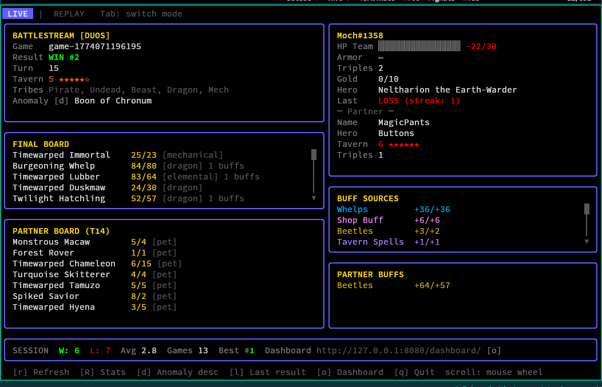
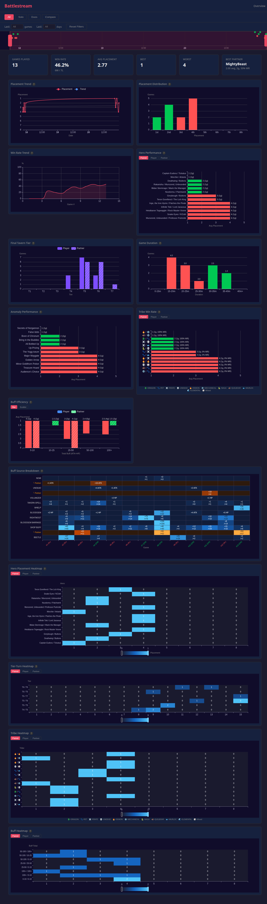
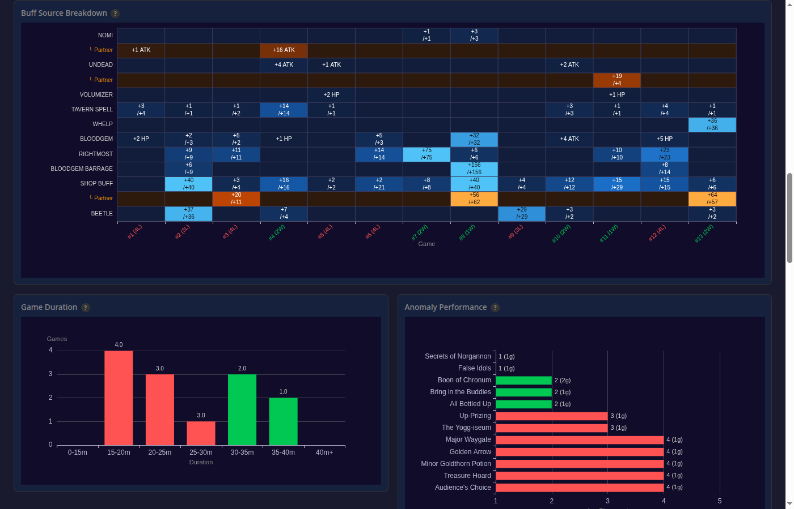

# battlestream

A Hearthstone Battlegrounds stat tracker and overlay backend. Monitors games via log parsing, persists aggregate stats, and exposes them via gRPC, REST, WebSocket, and file output.

## Screenshots

### Live TUI (Duos)


### Web Dashboard


### Buff Source Breakdown


## Features

- Real-time Hearthstone Battlegrounds log parsing
- Tracks health, armor, spell power, triples, tavern tier, board state, and stat modifications
- All 13 HDT buff source counters (blood gems, elementals, spellcraft, etc.)
- Duos support — partner hero, tier, triples, and last-seen board
- Persists game history and aggregate stats (BadgerDB)
- Atomic JSON file output for OBS browser sources and StreamDeck plugins
- gRPC + REST + WebSocket + SSE API
- Web dashboard with 11 interactive ECharts (placement trends, hero performance, heatmaps, buff analysis, tribe win rates)
- Live TUI dashboard with one-key browser launch (`o`)
- Cross-platform: Windows, macOS, Linux (Wine/Proton)

## Quick Start

```sh
# Find your Hearthstone install
battlestream discover

# Start the daemon (patches log.config, tails Power.log)
battlestream daemon

# Open live TUI dashboard in another terminal
battlestream tui

# Open web dashboard in browser (or press 'o' in the TUI)
open http://localhost:8080/dashboard/

# Query via REST
curl http://localhost:8080/v1/game/current
curl http://localhost:8080/v1/stats/aggregate
```

## Subcommands

| Command | Description |
|---|---|
| `daemon` | Start background service (gRPC + REST + WS + file output) |
| `tui` | Live TUI dashboard (connects to running daemon via gRPC) |
| `replay` | Offline step-through Power.log replay viewer |
| `discover` | Interactive install discovery wizard |
| `config` | Show/validate current configuration |
| `reparse` | Re-process all stored Power.log data |
| `db-reset` | Reset the BadgerDB database |
| `update` | Update to the latest version |
| `version` | Print version info |

## Installation

### Homebrew (macOS / Linux)

```sh
brew tap beeblebrox/tap
brew install battlestream
```

### Scoop (Windows)

```powershell
scoop bucket add battlestream https://github.com/beeblebrox/scoop-bucket
scoop install battlestream
```

### Download binary

Pre-built binaries for Linux, macOS (universal), and Windows are available on the [Releases](https://github.com/beeblebrox/battlestream/releases) page. Each release includes cosign signatures and SBOMs for supply chain verification.

### Build from source

Requires **Go 1.25+**.

```sh
git clone https://github.com/beeblebrox/battlestream
cd battlestream
go build -o battlestream ./cmd/battlestream
```

### Docker

```sh
HS_LOG_PATH=/path/to/hearthstone/Logs docker compose up
```

### Updating

If you installed via **Homebrew or Scoop** (recommended), update through your package manager — this avoids macOS Gatekeeper and Windows SmartScreen warnings:

```sh
# macOS / Linux
brew upgrade battlestream

# Windows
scoop update battlestream
```

If you downloaded the binary directly, you can self-update:

```sh
battlestream update
```

Note: `battlestream update` downloads the binary directly, so macOS and Windows may show security warnings on the updated binary. Use Homebrew or Scoop to avoid this.

## Configuration

Copy `config.example.yaml` to `~/.battlestream/config.yaml` and edit as needed.

See [docs/CONFIGURATION.md](docs/CONFIGURATION.md) for all options.

## Web Dashboard

The embedded web dashboard is served at `http://localhost:8080/dashboard/` when the daemon is running. It includes:

- Placement trend (line chart with win/loss coloring)
- Hero performance (bar chart, avg placement per hero)
- Game duration (bucketed bar chart)
- Anomaly performance
- Tribe win rate (with emoji tribe icons)
- Buff efficiency (scatter/bar toggle)
- Buff source breakdown (stacked heatmap)
- Hero placement heatmap
- Tier-turn heatmap
- Tribe heatmap
- Buff heatmap
- Buff accumulation (per-turn line chart, game detail view)

Filters: Solo/Duos mode toggle, Last N games, Last N days, timeline scrubber. All charts are duos-aware with player/partner/paired variant tabs.

Press `o` in the TUI to open the dashboard in your default browser.

## API

- gRPC: `localhost:50051`
- REST: `http://localhost:8080/v1/`
- Dashboard: `http://localhost:8080/dashboard/`
- WebSocket: `ws://localhost:8080/ws/events`
- SSE: `http://localhost:8080/v1/events`

See [docs/API.md](docs/API.md) for the full endpoint reference.

## TUI Keyboard Shortcuts

| Key | Action |
|-----|--------|
| `r` | Refresh current game |
| `R` | Refresh aggregate stats |
| `d` | Toggle anomaly description |
| `l` | Toggle last combat result |
| `o` | Open web dashboard in browser |
| `Tab` | Switch between Live and Replay modes |
| `q` | Quit |

Mouse wheel scrolls the board and buff panels. Drag dividers to resize columns.

## File Output

JSON files are written to `~/.battlestream/stats/` by default. See [docs/FILE_OUTPUT_SCHEMA.md](docs/FILE_OUTPUT_SCHEMA.md) for schema documentation.

## Platform Setup

- [Windows](docs/INSTALL_WINDOWS.md)
- [macOS](docs/INSTALL_MAC.md)
- [Linux (Wine/Proton)](docs/INSTALL_LINUX.md)
